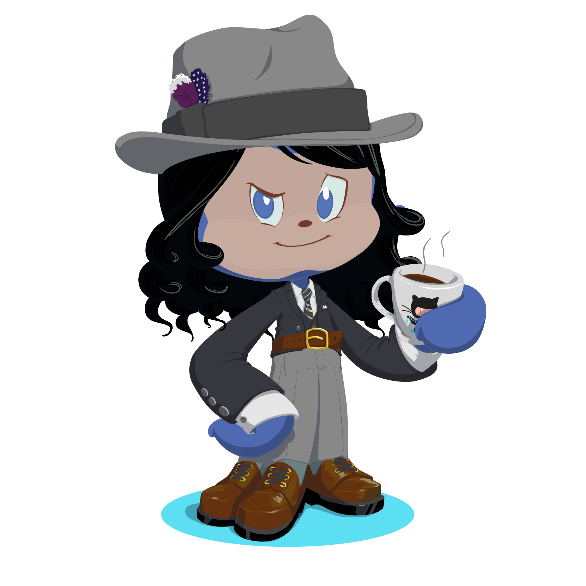

 &nbsp;&nbsp;  &nbsp;&nbsp;

<!-- Animated intro -->
[](https://git.io/typing-svg)
[](https://git.io/typing-svg)


---

<p align="center">
  
</p>

---

- 🎓 I'm **Wesley**, a **Systems Engineering student** at the National University of Engineering in Nicaragua. 

- 🧠 I specialize in <strong>backend engineering</strong>, automation, and building robust systems that combine architectural clarity with practical business value.<br>
- 🔩 My core tech stack includes .NET, php, Django, FastAPI, PostgreSQL, Docker, and cloud services like AWS and Azure.<br>
- ⚙️ I’m also experienced in automation platforms like UiPath and n8n for optimizing enterprise workflows.<br>
- 🌐 While backend is my domain, I complement it with functional frontend skills in React, jQuery, and WordPress for full-stack integration when needed.

```js
I believe persistence is the most important skill in software development 
— it's how we solve what others consider unsolvable.
```
---

<details open>
  <summary><h2>💼 About Me</h2></summary>
  <p>Currently preparing for <strong>Hackathon Nicaragua</strong> by designing backend architecture and data flows for a functional MVP.</p>
  <p>Active in events and tech meetups focused on <strong>engineering, product, and business automation</strong>.</p>
  <p>I keep my learning intentional — building scalable systems, clean APIs, and automation workflows that fit real industry use cases.</p>
</details>

<details open>
  <summary><h2>🚀 What I'm Learning Now</h2></summary>
  <p>Deepening my backend skillset with <strong>software architecture, automation flows</strong>, and <strong> design patterns</strong>.</p>
  <p>Implementing enterprise-level workflows with <strong>UiPath</strong> and <strong>n8n</strong>.</p>
  <p>Expanding my understanding of <strong>integration between frontend and backend</strong> to deliver end-to-end value.</p>
</details>

---

## 🧠 Skills & Tools

<table>
  <tr><th>Focus Area</th><th>Technologies</th></tr>

  <tr>
    <td>🚀 Backend Essentials</td>
    <td></td>
  </tr>

  <tr>
    <td>🧰 Programming</td>
    <td></td>
  </tr>

  <tr>
    <td>💾 Databases</td>
    <td></td>
  </tr>

  <tr>
    <td>📦 DevOps & Cloud</td>
    <td></td>
  </tr>

  <tr>
    <td>⚙️ Automation</td>
    <td>
    
    
    </td>
  </tr>

  <tr>
    <td>🧪 Testing Tools</td>
    <td></td>
  </tr>

  <tr>
    <td>🖥️ Frontend Capabilities</td>
    <td></td>
  </tr>

  <tr>
    <td>🔧 Tooling</td>
    <td></td>
  </tr>
</table>


---

## 📊 Most Used Languages
<p align="center">
  
<p>

## 🧩 Activity


---


